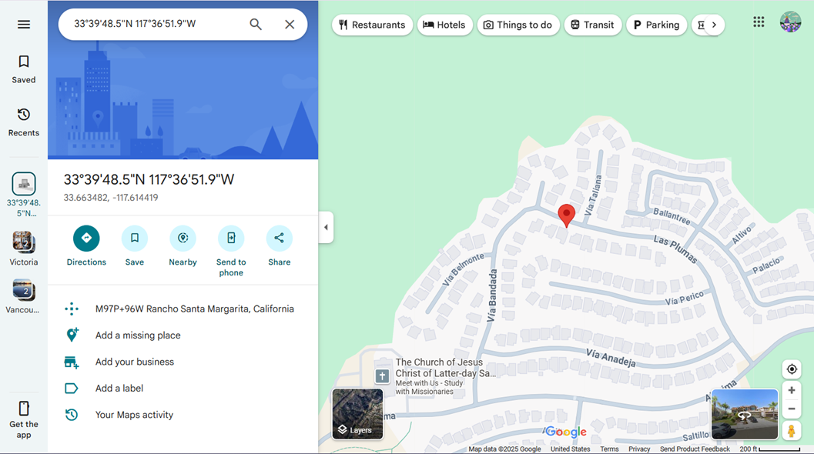

# 📍Wifi Locator

## 🛠️Description
Wifi Locator is a Python-based tool that determines a devices location using nearby Wi-Fi networks. It is ideal for devices without GPS or in indoor environments where GPS signals are weak or unavailable.

The program:
1. Scans and detects nearby Wi-Fi access points, or routers
2. Extracts their SSID (network name) and BSSID (MAC adress)
3. Sends the BSSID list to Qualcomm's Open Source Location API, which maps them to GPS coordinates
4. Returns the location in latitude and longitude, along with accuracy in meters

## 🔍How it Works
* Each Wi-Fi router broadcasts: 
  * SSID - Network name (not always unique)
  * BSSID - Unique MAC address identifying the router
* The Qualcomm API matches the detected BSSIDs with its database of known locations
* Communication with the API is done over HTTPS with JSON-foratted resquests 
* The API responds with:
  * HTTP 200 - Success, returns location data
  * HTTP 400 - Error (e.g. invalid API key)

## ⚙️Language or Frameworks Used
* Language: Python 3
* Networking: Qualcomm Open Source Location API
* Data Format: JSON over HTTPS

## 🚀How to Run
1. Clone the repository using:

        git clone <repo-url>

2. Acquire an API key by contacting Qualcomm at support.tps@qti.qualcomm.com and update the API_KEY variable with your key in the main script
3. Run the main script using:

        python3 qualcomm_post.py
4. Stop the program with:

        CTRL + C
## 📺Demo
Output:

    {'wifiAccessPoints': [
        {'macAddress': '3c:5c:f1:f9:c4:72'},
        {'macAddress': '7c:5e:98:25:37:64'},
        {'macAddress': '7c:5e:98:22:a9:43'},
        {'macAddress': '7c:5e:98:24:b7:e4'}
    ]}

    HTTP 200
    {
        "location": {
            "lat": 33.663482,
            "lng": -117.614419
        },
        "accuracy": 27.0
    }

